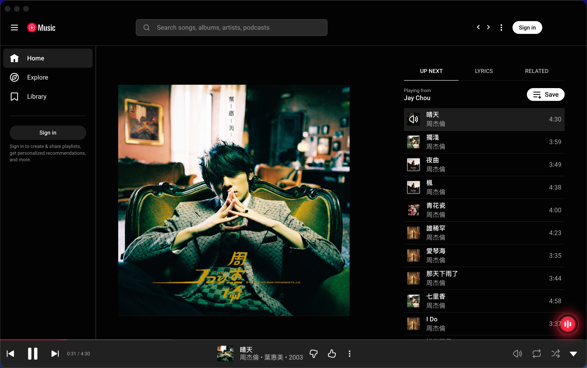

# Pear OpenStems

### A Pear Desktop extension that turns a music player into a stem-aware source for Live, Cover, practice, and DAW performance.

No virtual audio driver. No virtual audio cable. No manual audio patchbay. Install Pear OpenStems, open the player, and play.

[Download for macOS](https://github.com/lindazhang1220-rgb/pear-desktop-openstems/releases)
|
[Download for Windows](https://github.com/lindazhang1220-rgb/pear-desktop-openstems/releases)
|
[OBS Live Setup](#obs-live-setup)
|
[DAW / Plugin Setup](#daw--plugin-setup)
|
[Chinese Guide](#chinese-guide)

  

## Content

- [About](#about)
- [Download](#download)
- [Open The Control Center](#open-the-control-center)
- [What OpenStems Adds](#what-openstems-adds)
- [Stem Modes](#stem-modes)
- [OBS Live Setup](#obs-live-setup)
- [DAW / Plugin Setup](#daw--plugin-setup)
- [Quick Start](#quick-start)
- [Troubleshooting](#troubleshooting)
- [Project Note](#project-note)
- [Chinese Guide](#chinese-guide)

## About

Pear OpenStems is built on the official open-source [Pear Desktop](https://github.com/pear-devs/pear-desktop) project.

Pear Desktop provides the familiar desktop player foundation. OpenStems adds a music-control layer for key change, lead vocal control, accompaniment, stem balance, OBS output, and DAW output.

No virtual audio driver, no virtual audio cable, no manual audio patchbay, and no export-and-import loop. Install Pear OpenStems, open the player, and start shaping the music.

Use it when a song needs to become a Live source, a Cover backing track, a rehearsal band, an arrangement reference, or a DAW input.

## Download

Download the latest macOS and Windows installers from [GitHub Releases](https://github.com/lindazhang1220-rgb/pear-desktop-openstems/releases).

### macOS

1. Download `Pear-OpenStems-mac-setup-1.0.0.pkg`.
2. Open the package and finish installation.
3. Launch Pear OpenStems from Applications.
4. Play music as usual.
5. Open the OpenStems control center when you want to shape the track.

If macOS asks for confirmation before first launch, open `System Settings > Privacy & Security` and allow Pear OpenStems.

### Windows

1. Download `Pear-OpenStems-win_x64-1.0.0-setup.exe`.
2. Run the installer and finish installation.
3. Launch Pear OpenStems from the Start menu or desktop shortcut.
4. Play music as usual.
5. Open the OpenStems control center when you want to shape the track.

Pear OpenStems is designed to send audio to OBS or a DAW without a virtual sound card, virtual audio cable, or manual Windows audio routing.

## Open The Control Center

After the player is open, look for the glowing OpenStems button in the bottom-right corner. Click it when you want stem controls, key change, OBS output, or DAW output.

  

## What OpenStems Adds

### Live

Shape the music inside Pear OpenStems, then send a controlled stem mix to OBS as part of your Live setup.

### Cover

Transpose the song, lower the lead vocal, and build a backing track that sits naturally under your voice.

### Practice

Keep the band in the mix, reduce the part you want to play yourself, and rehearse against the original performance.

### DAW Session

Send the backing track into your DAW while your vocal chain, monitor mix, effects, and recording tracks stay in one session.

## Stem Modes

Choose the amount of control you need in the moment.

| Mode | Stems | Best for |
| --- | --- | --- |
| Realtime | Vocals, Bass, Drums, Piano, Others | Live monitoring, quick rehearsal, on-the-fly stem balance |
| Karaoke HQ | Lead Vocal, Accompaniment | Cover performance, vocal reduction, clean backing tracks |
| 8 Stems HQ | Lead Vocal, Backing Vocal, Guitar, Bass, Drums, Piano, Wind, Others | Arrangement study, instrument practice, performance mixes |

  

  

## OBS Live Setup

Use OBS when you want Pear OpenStems to act as a controllable music source for Live streaming.

1. Open OBS.
2. Play music in Pear OpenStems.
3. Choose a stem mode and shape the mix.
4. Click `Send to OBS`.
5. Use the Pear OpenStems source in your OBS scene.

No virtual audio cable is required. Pear OpenStems provides the OBS source path directly after installation.

  

  

## DAW / Plugin Setup

Use a DAW when you want the backing track in the same session as your vocal chain, effects, monitor mix, and recording tracks.

Pear OpenStems does not require a virtual sound card or virtual audio cable for DAW routing. The app sends the current OpenStems mix to the installed plug-in path for your platform.

### macOS: Audio Unit

1. Open your DAW or recording software.
2. Create a stereo instrument track, Software Instrument track, or Audio Unit Generator track.
3. Load the `Pear OpenStems` Audio Unit plug-in on that track.
4. Keep the track audible and routed to your main output, monitor bus, vocal mix, or recording chain.
5. Play music in Pear OpenStems.
6. Click `Send to DAW` in the Pear OpenStems app.

Different macOS DAWs name Audio Unit tracks differently. The important part is the same: create an instrument-style Audio Unit track, load Pear OpenStems, keep the track audible, then send music from the player.

### Windows: VST3

1. Open your DAW or recording software.
2. Create a stereo track that can host a VST3 instrument or effect plug-in.
3. Load the `Pear OpenStems` VST3 plug-in on that track.
4. Keep the plug-in track audible and routed to your main output, monitor bus, vocal mix, or recording chain.
5. Play music in Pear OpenStems.
6. Click `Send to DAW` in the Pear OpenStems app.

On Windows, the VST3 plug-in is the DAW receiver. You still start playback and click `Send to DAW` from Pear OpenStems, then monitor or record the audio inside the DAW. You do not need VB-CABLE, a virtual sound card, or a separate Windows audio patchbay.

  

  

## Quick Start

### Change Key

Play a song, move the key control, then return to `0` when you want the original key.

### Make A Cover Backing Track

Choose Karaoke HQ, lower or mute the lead vocal, then sing, rehearse, record, or perform Live.

### Practice An Instrument

Choose Realtime or 8 Stems HQ, lower the part you want to play yourself, and keep the rest of the band in the mix.

## Troubleshooting

| Problem | What to check |
| --- | --- |
| The app does not open on macOS | If macOS blocks the app, allow it in `System Settings > Privacy & Security`, then launch it again from Applications. |
| The app does not open on Windows | Launch it again from the Start menu or desktop shortcut. If Windows shows a security confirmation, allow the app you installed from this release. |
| You do not hear audio | Check the system sound output, make sure the player is not muted, turn off `Send to OBS` and `Send to DAW`, then return key to `0`. |
| Stem controls are not ready | Confirm the song is playing, wait for the OpenStems controls to update, or try another track. |
| `Send to OBS` does not work | Open OBS first, then turn `Send to OBS` off and on again. No virtual audio cable should be needed. |
| `Send to DAW` does not work on macOS | Open your DAW first, load the Pear OpenStems Audio Unit plug-in on an instrument or Audio Unit Generator track, keep the track audible, then turn `Send to DAW` off and on again. |
| `Send to DAW` does not work on Windows | Open your DAW first, load the Pear OpenStems VST3 plug-in on a stereo plug-in track, keep the track audible, then turn `Send to DAW` off and on again. |

## Project Note

Pear OpenStems is built on the official open-source [Pear Desktop](https://github.com/pear-devs/pear-desktop) project. This project is not affiliated with, authorized by, endorsed by, or officially connected with Google, YouTube, or YouTube Music. Trademarks belong to their respective owners.

---

## Chinese Guide

<strong>Pear OpenStems 中文说明</strong>

Pear OpenStems 基于官方开源 [Pear Desktop](https://github.com/pear-devs/pear-desktop) 项目开发。Pear Desktop 是播放器基础，OpenStems 是新增的音乐控制体验。

### 关于 Pear OpenStems

普通播放器把一首歌当成一整块声音。Pear OpenStems 保留播放器体验，同时让歌曲可以进入 Live、Cover、练习、录音和 DAW 混音场景。

无需虚拟声卡，无需虚拟音频线，无需手动音频跳线配置。安装 Pear OpenStems，打开播放器，就能开始使用。

### 下载和安装

#### macOS

1. 从 [GitHub Releases](https://github.com/lindazhang1220-rgb/pear-desktop-openstems/releases) 下载 `Pear-OpenStems-mac-setup-1.0.0.pkg`。
2. 打开安装包并完成安装。
3. 从 Applications 启动 Pear OpenStems。
4. 播放音乐后，看右下角发光的 OpenStems 图标；点击它打开 stem controls、key change、OBS output 和 DAW output。

如果 macOS 首次启动前要求确认，请打开 `系统设置 > 隐私与安全性`，允许 Pear OpenStems。

#### Windows

1. 从 [GitHub Releases](https://github.com/lindazhang1220-rgb/pear-desktop-openstems/releases) 下载 `Pear-OpenStems-win_x64-1.0.0-setup.exe`。
2. 运行安装器并完成安装。
3. 从 Start menu 或桌面快捷方式启动 Pear OpenStems。
4. 播放音乐后，打开 OpenStems 控制中心。

Windows 版本同样不需要虚拟声卡、不需要虚拟音频线，也不需要手动配置复杂的系统音频路由。

### 适合这些场景

- Live：把可控的 stem mix 送进 OBS，作为直播声音源。
- Cover：降低或静音 lead vocal，快速得到 backing track。
- DAW 人声场景：把伴奏送进 DAW，和 vocal chain、效果、监听、录音轨一起混。
- 乐器练习：保留乐队伴奏，降低你想自己演奏的声部。
- 编曲学习：听清 lead vocal、backing vocal、drums、bass、piano、guitar 和其他声部。

### 三种分轨模式

| 模式 | 可控制的音乐部分 | 适合什么 |
| --- | --- | --- |
| Realtime | Vocals、Bass、Drums、Piano、Others | Live 监听、快速练习、边播边调 |
| Karaoke HQ | Lead Vocal、Accompaniment | Cover、vocal reduction、干净 backing track |
| 8 Stems HQ | Lead Vocal、Backing Vocal、Guitar、Bass、Drums、Piano、Wind、Others | 编曲学习、乐器练习、performance mix |

### 在 OBS 中使用

1. 打开 OBS。
2. 在 Pear OpenStems 中播放音乐并调整好 stem mix。
3. 点击 `Send to OBS`。
4. 在 OBS 场景中使用 Pear OpenStems 声音源。

不需要虚拟音频线。Pear OpenStems 安装后直接提供 OBS 可用的音频路径。

### 在 DAW 中使用

#### macOS: Audio Unit

1. 打开你的 DAW 或录音编曲软件。
2. 新建一条立体声 instrument 音轨、Software Instrument 音轨，或 Audio Unit Generator 音轨。
3. 在这条音轨上加载 `Pear OpenStems` Audio Unit 插件。
4. 保持音轨可听，并把输出送到主输出、监听总线、人声混音链路或录音链路。
5. 在 Pear OpenStems 中播放音乐。
6. 在 Pear OpenStems app 里点击 `Send to DAW`。

不同 macOS DAW 的 Audio Unit 音轨名称可能不同。关键点相同：新建 instrument 类型的 Audio Unit 音轨，加载 Pear OpenStems，保持音轨可听，然后从播放器发送音乐。

#### Windows: VST3

1. 打开你的 DAW 或录音编曲软件。
2. 新建一条可以加载 VST3 instrument 或 effect 插件的立体声音轨。
3. 在这条音轨上加载 `Pear OpenStems` VST3 插件。
4. 保持插件音轨可听，并把输出送到主输出、监听总线、人声混音链路或录音链路。
5. 在 Pear OpenStems 中播放音乐。
6. 在 Pear OpenStems app 里点击 `Send to DAW`。

Windows 版本里，VST3 插件是 DAW 里的接收端。播放和 `Send to DAW` 仍然在 Pear OpenStems app 中操作，然后在 DAW 中监听、混音或录音。不需要 VB-CABLE、虚拟声卡或额外的 Windows 音频跳线配置。

