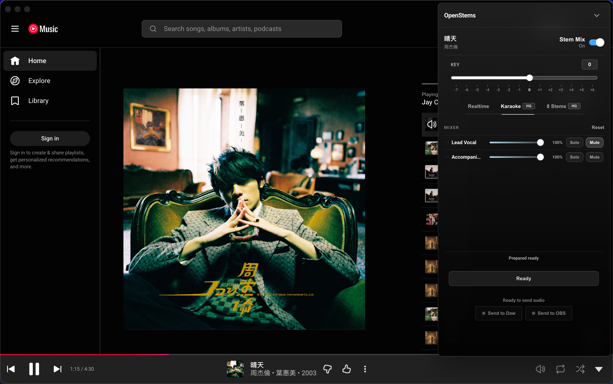
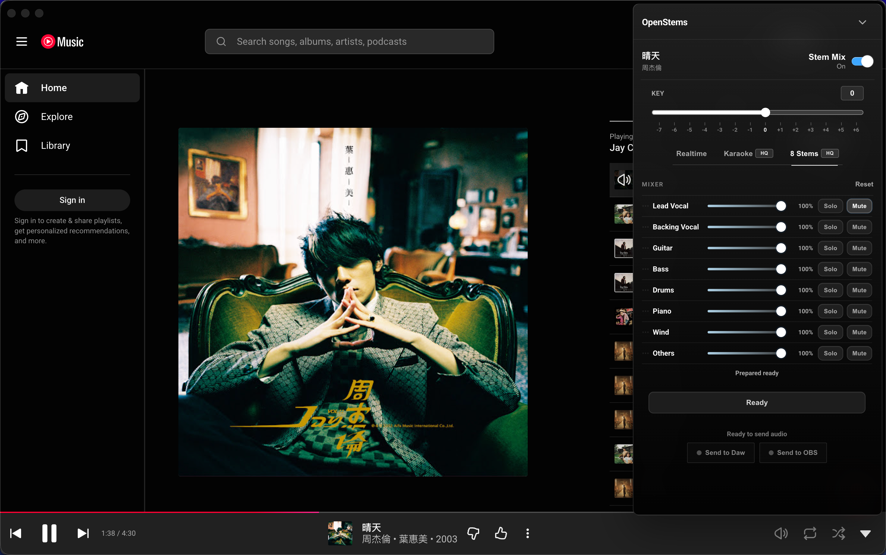
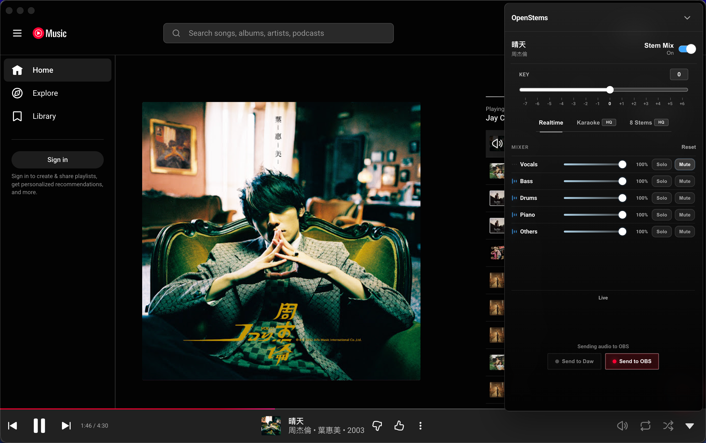
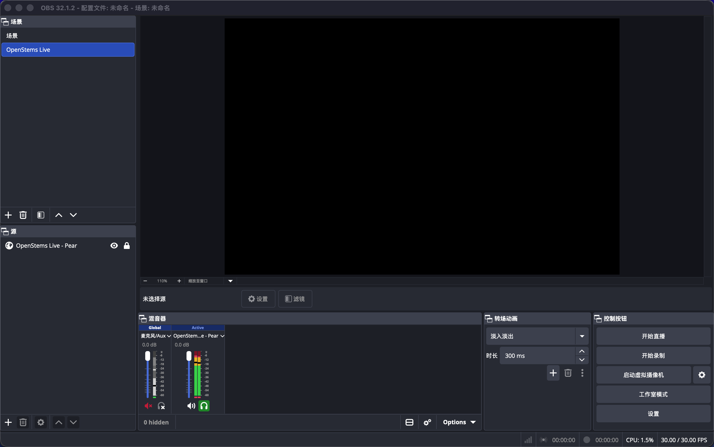
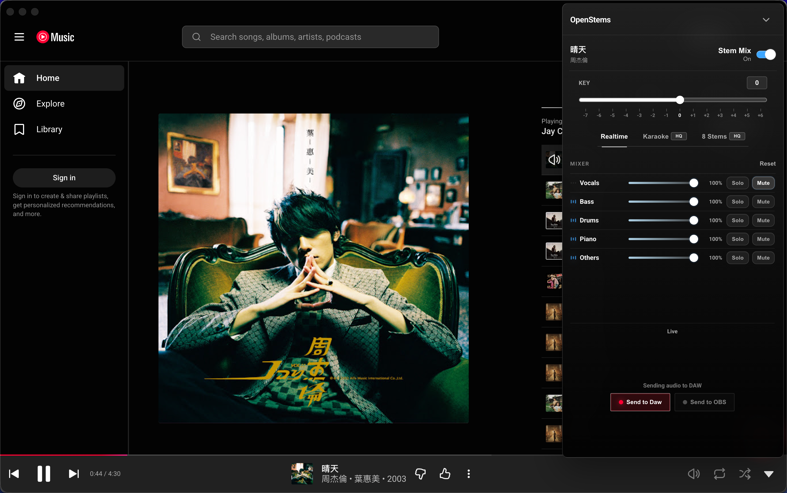
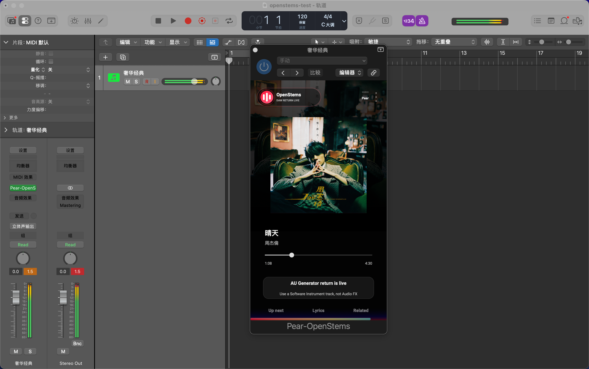

# Pear OpenStems

<h3>Turn a music player into a live backing track, stem mixer, karaoke tool, and performance source.</h3>

Built on the official open-source
<a href="https://github.com/pear-devs/pear-desktop">Pear Desktop</a> project.
Pear Desktop is the foundation. OpenStems is the added music-control experience.

<a href="https://github.com/lindazhang1220-rgb/pear-desktop-openstems/releases"><strong>Download macOS .pkg</strong></a>
 ·
<a href="#what-you-can-do-with-a-song">What it does</a>
 ·
<a href="#use-it-in-your-daw">DAW setup</a>
 ·
<a href="#中文说明">中文</a>

## The Music Player, Unlocked

Most music players treat a song as one flat recording. You can press play,
change volume, and skip tracks, but the vocal, drums, bass, piano, key, and
performance mix stay locked inside the file.

Pear OpenStems keeps the familiar Pear Desktop music experience, then opens the
song up for singers, streamers, K歌 users, cover creators, instrumentalists, and
music learners.

You can lower the lead vocal, change key, rebalance stems, build a backing
track, send the current mix into OBS, or route the accompaniment into your DAW
so it sits with your vocal chain, monitor mix, effects, and recording session.

It still feels like a music player. It just gives the song hands-on musical
control.

## What You Can Do With A Song

<table>
  <tr>
    <td width="33%" valign="top">
      <h3>Sing</h3>
      
Change key, lower the lead vocal, and build a backing track that fits your voice.

    </td>
    <td width="33%" valign="top">
      <h3>Stream</h3>
      
Send a clean, controllable music mix to OBS without exporting audio files.

    </td>
    <td width="33%" valign="top">
      <h3>Perform</h3>
      
Keep the band playing, reduce the part you want to play yourself, and rehearse with the original song.

    </td>
  </tr>
  <tr>
    <td width="33%" valign="top">
      <h3>Karaoke</h3>
      
Turn a song into a K歌 or cover backing track directly inside the player.

    </td>
    <td width="33%" valign="top">
      <h3>Learn</h3>
      
Listen into the arrangement: vocal, drums, bass, piano, guitar, backing vocal, and more.

    </td>
    <td width="33%" valign="top">
      <h3>Create</h3>
      
Capture the moment when an idea appears by sending the music straight into your production setup.

    </td>
  </tr>
</table>

## Three Ways To Shape The Music

Pear OpenStems uses music-first modes. You choose the amount of control you need
for the moment.

| Mode | Stems | Best for |
| --- | --- | --- |
| Realtime | Vocals, Bass, Drums, Piano, Others | Live listening, livestreaming, quick practice, low-latency balance changes |
| Karaoke HQ | Lead Vocal, Accompaniment | K歌, covers, vocal reduction, clean backing tracks |
| 8 Stems HQ | Lead Vocal, Backing Vocal, Guitar, Bass, Drums, Piano, Wind, Others | Detailed practice, learning arrangements, instrument rehearsal, performance mixes |

## Why It Feels Better

<table>
  <tr>
    <td width="50%" valign="top">
      <h3>High-Quality Playback First</h3>
      
When you just want to listen, Pear OpenStems plays the original song cleanly. When you use OpenStems, the goal is still musical: preserve a high-quality 44.1 kHz listening experience while giving you control over key, vocal level, and stem balance.

    </td>
    <td width="50%" valign="top">
      <h3>Low-Latency Live Control</h3>
      
Live control only matters if it responds while you are using it. Pear OpenStems is designed for quick adjustments during playback, so singers, streamers, K歌 users, and performers can shape the song without stopping the moment.

    </td>
  </tr>
  <tr>
    <td width="50%" valign="top">
      <h3>One Click To OBS</h3>
      
For everyday livestreaming, open OBS, play music in Pear OpenStems, and click Send to OBS. Your current OpenStems mix becomes the music source for your scene.

    </td>
    <td width="50%" valign="top">
      <h3>One Click To Your DAW</h3>
      
For singing livestreams and recording sessions, OBS is often not enough. You may want the backing track inside your DAW so it can sit beside your vocal input, vocal effects, monitor mix, recording track, and master output.

      
Open your DAW, load the Pear OpenStems Audio Unit plug-in on an instrument or Audio Unit Generator track, then click Send to DAW in Pear OpenStems.

    </td>
  </tr>
</table>

## See It In Action

<table>
  <tr>
    <td width="50%" valign="top">
      <h3>Realtime Stem Control</h3>
      
    </td>
    <td width="50%" valign="top">
      <h3>Karaoke And Backing Tracks</h3>
      
    </td>
  </tr>
  <tr>
    <td width="50%" valign="top">
      <h3>Up To 8 Music Parts</h3>
      
    </td>
    <td width="50%" valign="top">
      <h3>Send Music To OBS</h3>
      
    </td>
  </tr>
  <tr>
    <td width="50%" valign="top">
      <h3>OBS Livestreaming</h3>
      
    </td>
    <td width="50%" valign="top">
      <h3>Send Backing Tracks To Recording Software</h3>
      
    </td>
  </tr>
  <tr>
    <td width="50%" valign="top">
      <h3>Singing Livestreams And Recording Software</h3>
      
    </td>
    <td width="50%" valign="top"></td>
  </tr>
</table>

## Install The macOS Package

1. Download the Pear OpenStems macOS `.pkg` release from
   [GitHub Releases](https://github.com/lindazhang1220-rgb/pear-desktop-openstems/releases).
2. Open the package and finish installation.
3. Launch Pear OpenStems from Applications.
4. Play music as usual.
5. Open the OpenStems control center when you want key change, vocal control,
   stem balance, backing tracks, OBS output, or DAW output.

If macOS asks for confirmation before first launch, open
`System Settings > Privacy & Security` and allow Pear OpenStems.

## Use It In OBS

1. Open OBS.
2. Start playback in Pear OpenStems.
3. Shape the song in the OpenStems control center.
4. Click Send to OBS.
5. Use the current OpenStems mix in your livestream or recording scene.
6. Click Send to OBS again when you want to stop sending.

## Use It In Your DAW

The macOS package installs both the Pear OpenStems app and the Pear OpenStems
Audio Unit plug-in. The plug-in lets your recording software receive the music
you send from Pear OpenStems.

Use this when you want the backing track inside a singing livestream, vocal
recording session, rehearsal project, or performance mix.

1. Open your DAW or recording software.
2. Create a stereo instrument track, Software Instrument track, or Audio Unit
   Generator track, depending on how your DAW names AU instrument sources.
3. Load the Pear OpenStems Audio Unit plug-in on that track.
4. Keep the track enabled and route it to your main output, monitor bus, vocal
   mix, or recording chain.
5. Start playback in Pear OpenStems.
6. Open the OpenStems control center and click Send to DAW.
7. Adjust key, vocal level, accompaniment level, or stem balance in Pear
   OpenStems while your DAW handles vocal effects, monitoring, mixing, and
   recording.
8. Click Send to DAW again when you want to stop sending.

Different macOS DAWs name AU tracks differently. The important part is the
same: create an instrument-style AU track, load Pear OpenStems, keep the track
audible, then send music from the player.

## Quick Starts

<table>
  <tr>
    <td width="33%" valign="top">
      <h3>Change Key</h3>
      <ol>
        <li>Play a song.</li>
        <li>Move the key control up or down.</li>
        <li>Sing or play along in the new key.</li>
        <li>Return to <code>0</code> for the original key.</li>
      </ol>
    </td>
    <td width="33%" valign="top">
      <h3>Make A Karaoke Or Cover Backing Track</h3>
      <ol>
        <li>Open the OpenStems control center.</li>
        <li>Choose Karaoke HQ when you want Lead Vocal and Accompaniment control.</li>
        <li>Lower or mute the lead vocal.</li>
        <li>Adjust the accompaniment level.</li>
        <li>Sing, rehearse, record, or stream.</li>
      </ol>
    </td>
    <td width="33%" valign="top">
      <h3>Practice An Instrument</h3>
      <ol>
        <li>Open the OpenStems control center.</li>
        <li>Choose Realtime or 8 Stems HQ.</li>
        <li>Lower the part you want to play yourself.</li>
        <li>Keep the rest of the band in the mix.</li>
        <li>Practice or perform along with the song.</li>
      </ol>
    </td>
  </tr>
</table>

## Troubleshooting

| Problem | What to check |
| --- | --- |
| The app does not open | Make sure you are on macOS. If macOS blocks the app, allow it in `System Settings > Privacy & Security`, then launch it again from Applications. |
| You do not hear audio | Check the Mac sound output, make sure the player is not muted, turn off Send to OBS and Send to DAW, then return key to `0`. |
| Stem controls are not ready | Confirm the song is playing, wait for the OpenStems controls to update, or try another track. |
| Send to OBS does not work | Open OBS first, then turn Send to OBS off and on again. |
| Send to DAW does not work | Open your DAW first, load the Pear OpenStems Audio Unit plug-in on an instrument or Audio Unit Generator track, keep the track audible, then turn Send to DAW off and on again. |

---

## 中文说明

<strong>Pear OpenStems 中文</strong>

<h3>把音乐播放器变成现场伴奏、分轨控制器、K歌工具和直播音源。</h3>

Pear OpenStems 基于官方开源
<a href="https://github.com/pear-devs/pear-desktop">Pear Desktop</a>
项目开发。Pear Desktop 是基础，OpenStems 是新增的音乐控制体验。

<a href="https://github.com/lindazhang1220-rgb/pear-desktop-openstems/releases"><strong>下载 macOS .pkg</strong></a>
 ·
<a href="#一首歌可以怎样被你使用">它能做什么</a>
 ·
<a href="#在你的录音编曲软件中使用">DAW 设置</a>
 ·
<a href="#pear-openstems">English</a>

## 被解锁的音乐播放器

普通音乐播放器把一首歌当成一整块声音。你可以播放、暂停、调音量，但人声、鼓、贝斯、钢琴、音调，以及你想带进直播间或录音编曲软件的声音，都被锁在里面。

Pear OpenStems 保留 Pear Desktop 熟悉的桌面音乐体验，同时让一首歌可以被你拿来唱、拿来演、拿来直播、拿来练习、拿来创作。

你可以降低主唱、升降调、调整分轨平衡、做伴奏，把当前音乐送进 OBS，也可以把伴奏送进你的录音编曲软件，和人声链路、效果器、监听、录音轨、总线输出一起处理。

它仍然是音乐播放器，只是歌曲终于可以被你用音乐人的方式控制。

## 一首歌可以怎样被你使用

<table>
  <tr>
    <td width="33%" valign="top">
      <h3>唱</h3>
      
升降调、降低主唱，做出适合自己音域的伴奏。

    </td>
    <td width="33%" valign="top">
      <h3>直播</h3>
      
把可控制的音乐混音送进 OBS，不用先导出音频文件。

    </td>
    <td width="33%" valign="top">
      <h3>演奏</h3>
      
保留乐队伴奏，降低你想自己演奏的部分，跟着原曲排练。

    </td>
  </tr>
  <tr>
    <td width="33%" valign="top">
      <h3>K歌</h3>
      
在播放器里直接把歌曲变成 K歌或翻唱伴奏。

    </td>
    <td width="33%" valign="top">
      <h3>学歌</h3>
      
听清编曲里的主唱、和声、鼓、贝斯、钢琴、吉他和其他声部。

    </td>
    <td width="33%" valign="top">
      <h3>创作</h3>
      
灵感出现时，把音乐直接送进你的制作环境，不让想法断掉。

    </td>
  </tr>
</table>

## 三种方式控制音乐

Pear OpenStems 用音乐场景来组织能力。你按当下需要选择控制深度。

| 模式 | 可控制的音乐部分 | 适合什么 |
| --- | --- | --- |
| Realtime | Vocals、Bass、Drums、Piano、Others | 边播边调、直播、快速练习、低延迟控制 |
| Karaoke HQ | Lead Vocal、Accompaniment | K歌、翻唱、降低主唱、制作干净伴奏 |
| 8 Stems HQ | Lead Vocal、Backing Vocal、Guitar、Bass、Drums、Piano、Wind、Others | 精细练习、学编曲、乐器排练、现场伴奏混音 |

## 为什么用起来不一样

### 先是一款好听的播放器

当你只想听歌时，Pear OpenStems 保持原曲播放的干净和自然。打开 OpenStems 后，目标依然是音乐性：在 44.1 kHz 的高质量听感下，给你音调、人声和分轨平衡的控制。

### 可以在播放中实时调整

直播、K歌、翻唱和乐器演奏不应该被导出文件打断。Pear OpenStems 面向播放中的快速调整设计，让你在歌曲继续播放时塑造伴奏、人声和 key。

### 一键进入 OBS

普通直播时，打开 OBS，在 Pear OpenStems 播放音乐，点击 Send to OBS。当前 OpenStems 混音就可以成为直播场景里的音乐源。

### 一键进入你的 DAW

唱歌直播和录音时，OBS 往往不是全部。你可能需要把伴奏放进录音编曲软件里，和麦克风输入、人声效果、监听、录音轨、主输出一起混。

在你的 DAW 中加载 Pear OpenStems Audio Unit 插件，然后在 Pear OpenStems 里点击 Send to DAW。

## 看看它怎样使用

### 实时分轨控制

### K歌和伴奏

### 最多 8 个音乐部分

### 把音乐送进 OBS

### 普通直播进入 OBS

### 把伴奏送进录音编曲软件

### 唱歌直播和录音编曲软件

## 安装 macOS pkg

1. 从
   [GitHub Releases](https://github.com/lindazhang1220-rgb/pear-desktop-openstems/releases)
   下载 Pear OpenStems macOS `.pkg` 发布包。
2. 打开安装包并完成安装。
3. 从 Applications 启动 Pear OpenStems。
4. 像平常一样播放音乐。
5. 当你需要升降调、人声控制、分轨平衡、伴奏、OBS 输出或 DAW 输出时，打开 OpenStems 控制中心。

如果 macOS 首次启动前要求确认，请打开 `系统设置 > 隐私与安全性`，允许 Pear OpenStems。

## 在 OBS 中使用

1. 打开 OBS。
2. 在 Pear OpenStems 中开始播放音乐。
3. 在 OpenStems 控制中心调整歌曲。
4. 点击 Send to OBS。
5. 在直播或录制场景中使用当前 OpenStems 混音。
6. 再次点击 Send to OBS 停止发送。

## 在你的录音编曲软件中使用

macOS 安装包会安装 Pear OpenStems 应用，也会安装 Pear OpenStems Audio Unit 插件。录音编曲软件通过这个插件接收你从 Pear OpenStems 发送过来的音乐。

当你做唱歌直播、人声录音、排练工程或现场演出混音时，可以这样使用：

1. 打开你的 DAW 或录音编曲软件。
2. 根据软件命名，新建一条立体声 instrument 音轨、Software Instrument 音轨，或 Audio Unit Generator 音轨。
3. 在这条音轨上加载 Pear OpenStems Audio Unit 插件。
4. 保持音轨启用，并把输出送到主输出、监听总线、人声混音链路或录音链路。
5. 在 Pear OpenStems 中开始播放音乐。
6. 打开 OpenStems 控制中心，点击 Send to DAW。
7. 在 Pear OpenStems 里调整 key、人声、伴奏或分轨平衡，同时让 DAW 处理人声效果、监听、混音和录音。
8. 再次点击 Send to DAW 停止发送。

不同 macOS 录音编曲软件里的 AU 音轨菜单名称可能不同。关键点相同：新建 instrument 类型的 AU 音轨，加载 Pear OpenStems，保持音轨可听，然后从播放器发送音乐。

## 快速开始

### 升降调

1. 播放一首歌。
2. 上下移动音调控制。
3. 用新的 key 练唱或演奏。
4. 回到 `0` 即回到原调。

### 做 K歌或翻唱伴奏

1. 打开 OpenStems 控制中心。
2. 如果要控制主唱和伴奏，选择 Karaoke HQ。
3. 降低或静音主唱。
4. 调整伴奏音量。
5. 开始唱、练习、录制或直播。

### 用歌曲做乐器练习

1. 打开 OpenStems 控制中心。
2. 选择 Realtime 或 8 Stems HQ。
3. 降低你想自己演奏的部分。
4. 保留其他乐器继续播放。
5. 跟着歌曲练习或现场演奏。

## 常见问题

| 问题 | 可以检查什么 |
| --- | --- |
| App 打不开 | 确认当前系统是 macOS。如果 macOS 阻止打开，请在 `系统设置 > 隐私与安全性` 中允许，然后从 Applications 再次启动。 |
| 听不到声音 | 检查 Mac 当前声音输出，确认播放器没有静音，关闭 Send to OBS 和 Send to DAW，并把音调调回 `0`。 |
| 分轨控制没有准备好 | 确认歌曲正在播放，等待 OpenStems 控制更新，或换一首歌测试。 |
| Send to OBS 不工作 | 先打开 OBS，再关闭并重新开启 Send to OBS。 |
| Send to DAW 不工作 | 先打开录音编曲软件，在 instrument 或 Audio Unit Generator 音轨上加载 Pear OpenStems Audio Unit 插件，确认音轨可听，再关闭并重新开启 Send to DAW。 |

## Project Note

Pear OpenStems is built on the official open-source
[Pear Desktop](https://github.com/pear-devs/pear-desktop) project. This project
is not affiliated with, authorized by, endorsed by, or officially connected with
Google, YouTube, or YouTube Music. Trademarks belong to their respective owners.

## 项目声明

Pear OpenStems 基于官方开源
[Pear Desktop](https://github.com/pear-devs/pear-desktop) 项目开发。本项目与
Google、YouTube 或 YouTube Music 没有关联、授权、背书或官方连接。相关商标归其各自所有者所有。

